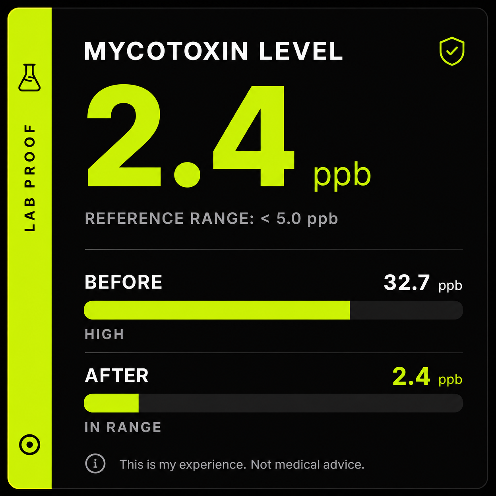

# DOSE OF PROOF Brand Asset Library

**Complete brand asset collection for custom website development**

---

## 📋 Overview

This library contains high-quality PNG/JPG images and optimized SVG components for the DOSE OF PROOF brand, following a dark clinical aesthetic with acid lime accents.

**Brand Colors:**
- Background: `#0D0D0D` (Pure Black)
- Accent: `#C8FF00` (Acid Lime)
- Text: `#FFFFFF` (White)
- Muted: `#B0B0B0` (Gray)
- Warm: `#C8733A` (Warm Accent)

---

## 📁 Directory Structure

```
dose-of-proof-brand-assets/
├── images/
│   ├── hero/                    # Hero background images (3 variants)
│   ├── proof-cards/             # Proof/data visualization cards (8 images)
│   ├── social-templates/        # Social media static templates (5 images)
│   ├── lead-magnets/            # Lead magnet & CTA images (3 images)
│   └── textures/                # Brand patterns & textures (2 images)
├── svgs/
│   ├── icons/                   # 25 icons across 5 categories
│   ├── diagrams/                # 3 clinical diagrams
│   ├── decorative/              # 5 decorative elements & dividers
│   ├── animated/                # 3 animated SVG overlays
│   └── logos/                   # 3 logo variants
└── README.md                    # This file
```

---

## 🖼️ Image Assets

### Hero Background Images (3 variants)
Located in: `images/hero/`

| File | Size | Use Case |
|------|------|----------|
| `hero-dark-grid-1920x1080.png` | 1920×1080 | Desktop hero with tech grid texture |
| `hero-dark-gradient-light-leak-1920x1080.png` | 1920×1080 | Desktop hero with subtle gradient |
| `hero-dark-dna-watermark-1920x1080.png` | 1920×1080 | Desktop hero with DNA watermark |

**Usage:** Set as full-width hero backgrounds on landing pages and main sections.

---

### Proof/Data Visualization Cards (8 images)
Located in: `images/proof-cards/`

| File | Size | Content |
|------|------|---------|
| `proof-mycotoxin-card-1080x1080.png` | 1080×1080 | Before/after mycotoxin levels |
| `proof-inflammation-chart-1080x1080.png` | 1080×1080 | Inflammation marker reduction chart |
| `proof-bpc157-protocol-card-1080x1080.png` | 1080×1080 | BPC-157 peptide protocol details |
| `proof-recovery-timeline-1080x1080.png` | 1080×1080 | 4-week recovery milestone timeline |
| `proof-protocol-stack-1080x1080.png` | 1080×1080 | 5-compound protocol stack |
| `proof-vagal-tone-1080x1080.png` | 1080×1080 | Vagal tone improvement gauge |
| `proof-what-doctors-miss-1080x1080.png` | 1080×1080 | 3 critical gaps in medical training |
| `proof-scan-highlight-1080x1080.png` | 1080×1080 | Medical scan with annotations |

**Usage:** Use in carousel galleries, social media posts, email newsletters. All include medical disclaimers.

---

### Social Media Static Templates (5 images)
Located in: `images/social-templates/`

| File | Size | Format |
|------|------|--------|
| `social-quote-card-1080x1080.png` | 1080×1080 | Instagram square |
| `social-wish-known-1080x1080.png` | 1080×1080 | Instagram square |
| `social-protocol-snapshot-1080x1080.png` | 1080×1080 | Instagram square |
| `social-before-after-1080x1080.png` | 1080×1080 | Instagram square |
| `social-condition-checklist-1080x1080.png` | 1080×1080 | Instagram square |

**Usage:** Post directly to Instagram, repurpose for Twitter/LinkedIn by cropping. Ready for social media scheduler.

---

### Lead Magnet & CTA Images (3 images)
Located in: `images/lead-magnets/`

| File | Size | Purpose |
|------|------|---------|
| `lead-magnet-30day-checklist-1200x628.png` | 1200×628 | "First 30 Days" checklist header |
| `cta-get-tested-1200x628.png` | 1200x628 | "Get Tested" call-to-action |
| `social-proof-badge-1200x628.png` | 1200×628 | Community proof badge |

**Usage:** Email headers, landing page sections, social media banners.

---

### Brand Patterns & Textures (2 images)
Located in: `images/textures/`

| File | Size | Pattern |
|------|------|---------|
| `texture-dot-grid-1080x1080.png` | 1080×1080 | Fine dot grid (seamless) |
| `texture-noise-grain-1080x1080.png` | 1080×1080 | Subtle grain (seamless) |

**Usage:** Tile as section backgrounds for subtle texture. Use as CSS background-image with `background-repeat: repeat`.

---

## 🎨 SVG Components

### Icons (25 total)
Located in: `svgs/icons/proof-icons.svg`

**Categories:**

1. **Proof/Verification (4 icons)**
   - Checkmark Shield
   - Scan Line
   - Chart Up
   - Warning Triangle

2. **Health/Body (6 icons)**
   - Spine Neck (C1-C2)
   - Brain Circuit
   - Inflammation Flame
   - Gut Intestine
   - Mast Cell
   - Heart Rate Vagal

3. **Protocol/Science (5 icons)**
   - Pill Capsule
   - Microscope
   - Test Tube
   - DNA Helix
   - Lab Flask

4. **System/Meta (5 icons)**
   - Gear Settings
   - Clock Time
   - Calendar Day
   - Folder Structure
   - Target Crosshair

5. **Social/Engagement (5 icons)**
   - Bookmark Save
   - Share Arrow
   - Comment Bubble
   - Fire Hot
   - Trending Up

**Usage:** Reference individual icons by ID. All are `#C8FF00` on transparent background. Scale as needed (24px to 64px recommended).

---

### Decorative Elements (5 SVGs)
Located in: `svgs/decorative/decorative-elements.svg`

| Element | Use Case |
|---------|----------|
| Horizontal Divider | Section separators with glow effect |
| Quote Mark | Pull quote styling |
| Three Dots | Section breaks |
| Footer Separator | Footer dividers with wordmark |
| Corner Brackets | Card accent frames |

**Usage:** Embed as inline SVG or reference as background images. Customize colors by modifying stroke/fill attributes.

---

### Diagrams (3 SVGs)
Located in: `svgs/diagrams/clinical-diagrams.svg`

| Diagram | Content |
|---------|---------|
| Mold Exposure Mechanism | Indoor mold → mycotoxins → inflammation → symptoms |
| CCI/Upper Cervical Anatomy | C1-C2 spine alignment & vagus nerve connection |
| Peptide Protocol Timeline | 30-day cycle with weekly compound rotation |

**Usage:** Embed as inline SVG for interactive tooltips. Use in educational sections and protocol pages.

---

### Animated Overlays (3 SVGs)
Located in `svgs/animated/animated-overlays.svg`

| Animation | Effect |
|-----------|--------|
| Scan Line | Horizontal sweep with glow |
| Pulse Ring | Expanding rings around metrics |
| Fade-In Reveal | Staggered text entrance |

**Usage:** Embed in HTML with CSS animations enabled. Customize timing by modifying `animation-duration` values.

---

### Logo Variants (9 SVGs)
Located in: `svgs/logos/logo-variants.svg`

| Logo | Use Case |
|------|----------|
| Wordmark Horizontal | Primary logo for headers |
| Icon Only | Favicon, app icon |
| Stacked Logo | Mobile navigation, profile |
| Wordmark with Tagline | Landing page hero |
| Icon Badge (Circular) | Verification badge |
| Minimal Mark | Small spaces, favicons |
| Horizontal Lock-up | Social media profiles |
| Monogram (D+P) | Compact branding |
| Wordmark Compact | Small headers |

**Usage:** Reference by ID. All maintain 1:1 aspect ratio for icons. Wordmarks are flexible width.

---

## 📐 Technical Specifications

### Image Formats
- **PNG:** All images with transparency or complex graphics
- **JPG:** Hero backgrounds (quality: 90)
- **Compression:** Optimized for web (< 200KB per image)

### SVG Specifications
- **Format:** SVG 1.1, optimized
- **ViewBox:** Declared on all elements
- **Colors:** Hex codes (#C8FF00, #FFFFFF, #0D0D0D)
- **Strokes:** 1.5-2px for visibility
- **Accessibility:** Semantic group IDs for easy reference

### Responsive Sizes
- **Desktop:** 1920×1080 (hero), 1200×628 (banners)
- **Mobile:** 1080×1920 (vertical), 1080×1080 (square)
- **Social:** 1080×1080 (Instagram), 1200×628 (Twitter/LinkedIn)

---

## 🎯 Brand Guidelines

1. **Dark Backgrounds Always** — All designs live on #0D0D0D
2. **One Accent Color** — #C8FF00 for highlights only, never dominant
3. **No Gradients** — Flat, high-contrast, mobile-first
4. **One Idea Per Visual** — Never pack multiple data points into one template
5. **Font Hierarchy** — Loud headline, medium body, quiet footer
6. **No Stock Photo Aesthetic** — Real, raw, specific
7. **Medical Disclaimers** — Required on all protocol/health claim visuals

---

## 🚀 Implementation Tips

### Using Images in HTML
```html
<!-- Hero background -->
<div style="background-image: url('images/hero/hero-dark-grid-1920x1080.png'); background-size: cover;">
  <!-- Content -->
</div>

<!-- Proof card -->

```

### Using SVGs in HTML
```html
<!-- Inline SVG -->
<svg viewBox="0 0 24 24" width="32" height="32">
  <!-- Icon content -->
</svg>

<!-- External SVG reference -->

```

### CSS Background Textures
```css
.section {
  background-image: url('images/textures/texture-dot-grid-1080x1080.png');
  background-repeat: repeat;
  background-size: 200px;
}
```

---

## 📝 File Naming Convention

All files follow this pattern:
```
[category]-[description]-[dimensions].png
```

Examples:
- `hero-dark-grid-1920x1080.png`
- `proof-mycotoxin-card-1080x1080.png`
- `social-quote-card-1080x1080.png`

---

## ✅ Checklist for Website Integration

- [ ] All hero images placed in correct sections
- [ ] Proof cards integrated into carousel/gallery
- [ ] Social templates ready for scheduler
- [ ] Lead magnet images placed on landing page
- [ ] Texture backgrounds applied to sections
- [ ] Icons imported and scaled correctly
- [ ] Diagrams embedded with proper sizing
- [ ] Animated overlays tested in target browsers
- [ ] Logo variants used appropriately (header, footer, mobile)
- [ ] All medical disclaimers visible on health content
- [ ] Color contrast verified (WCAG AA minimum)
- [ ] Images optimized for web (< 200KB each)

---

## 🔄 Version Control

**Version:** 1.0  
**Created:** May 30, 2026  
**Brand:** DOSE OF PROOF  
**Aesthetic:** Dark Clinical with Acid Lime Accents

---

## 📞 Support

For questions about asset usage, color specifications, or technical implementation, refer to the brand guidelines section above or consult the individual SVG/image files for detailed specifications.

---

**All assets are optimized for web use and ready for immediate integration into your custom website.**
